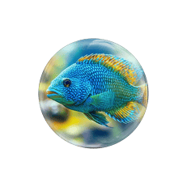
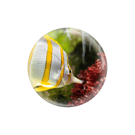

# Orb Creator

A shell script that composites a glass orb effect onto images using ImageMagick's Screen blend mode. Drop images into `input/`, run the script, and get orb-wrapped PNGs in `output/`.

   

## How it works

1. Detects the orb's visible circle bounds from its alpha channel
2. Center-crops and resizes each source image to fill the circle area
3. Composites the orb overlay using **Screen** blend mode (dark areas become transparent, light reflections stay white)
4. Outputs transparent PNGs with the image visible through the glass orb
5. Optimizes with [Clop](https://lowtechguys.com/clop) if available

## Requirements

- [ImageMagick](https://imagemagick.org/) (`brew install imagemagick`)
- [Clop](https://lowtechguys.com/clop) (optional, for PNG optimization)

## Usage

```bash
# Drop images into input/, then run:
./apply-orb.sh

# Custom input directory
./apply-orb.sh /path/to/images

# Custom output size (default: orb's native 1873x1873)
./apply-orb.sh --size 231

# All options
./apply-orb.sh [input_dir] [options]
```

### Options

| Option | Description | Default |
|--------|-------------|---------|
| `--size N` | Output size in pixels | Orb's native size |
| `--start N` | Starting file number | Auto-detect |
| `--orb PATH` | Path to orb overlay | `./assets/orb.png` |
| `--output DIR` | Output directory | `./output` |
| `-j, --jobs N` | Parallel jobs | Number of CPU cores |

## Project Structure

```
orb-creator/
├── apply-orb.sh      # Main script
├── assets/
│   └── orb.png       # Glass orb overlay (1873x1873)
├── input/            # Source images (any format)
└── output/           # Generated orb PNGs
```

## Supported Formats

PNG, JPG, JPEG, WebP, BMP, TIFF, AVIF, HEIC, GIF, SVG
